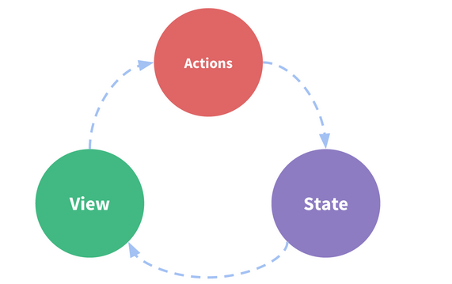

Vuex 是一个专为 Vue.js 应用程序开发的状态管理模式。它采用集中式存储管理应用的所有组件的状态，并以相应的规则保证状态以一种可预测的方式发生变化。
## 单向数据流

- state，驱动应用的数据源；
- view，以声明方式将 state 映射到视图；
- actions，响应在 view上的用户输入导致的状态变化


## state 分割
Vuex 允许我们将 store 分割成模块（module）。每个模块拥有自己的
state、mutation、action、getter、甚至是嵌套子模块——从上至下进行同样方式的分割。
```
const store = new Vuex.Store({
  modules,
})
export default store
```

## Vuex 使用规则
- 应用层级状态应集中到单个store对象中
- 提交mutation 是更改状态的唯一方法，并且这个过程是同步的
- 异步逻辑应该封装到action中
