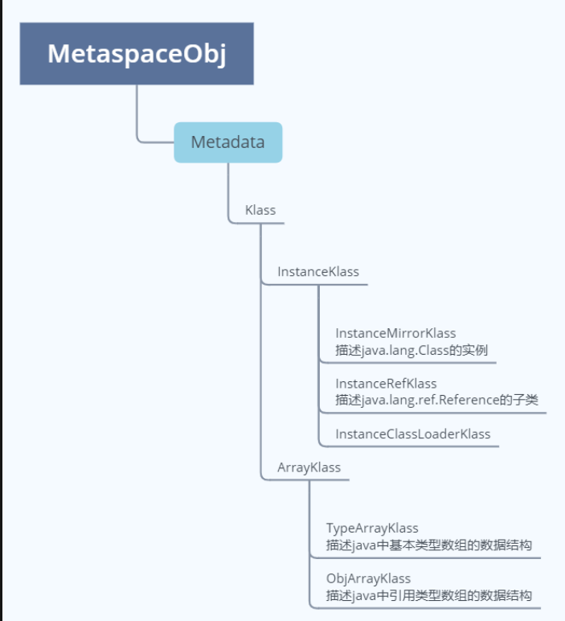
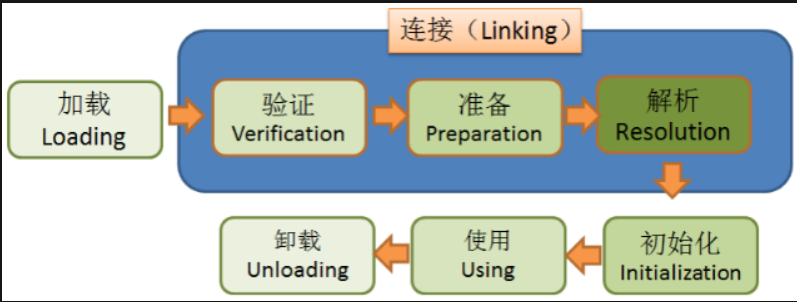

JVM 底层类加载

## oop-klass模型
我们平时写的java类编译成.class文件，JVM加载.class文件，那么加载.class文件之后在JVM中就是oop-kclass（C++）模型形式存在的。JVM内部基于oop-klass模型分两部分描述一个java类,第一个模型是oop（ordinary object pointer,也即普通对象指针）,第二个模型是klass.


### oop
c++描述oop的层级关系时在 oopsHierarchy.hpp 中进行了如下定义:
```
typedef class oopDesc*                            oop;
typedef class   instanceOopDesc*            instanceOop;
typedef class   arrayOopDesc*                    arrayOop;
typedef class     objArrayOopDesc*            objArrayOop;
typedef class     typeArrayOopDesc*            typeArrayOop;
```
说明

| 类名  | 说明|
|---|---|
| oop  |oop的顶级父类|
| instanceOop  |表示java类实例|
| arrayOop  |数组对象,定义了数组oops的抽象基类|
| objArrayOop  |表示引用类型数组对象|
| typeArrayOop  |表示基本类型数组对象|

### klass
klass则包含元数据和方法信息，用来描述Java类



- 普通的Java类（非数组）在JVM中对应的是instanceKlass类的实例，再来说下它的三个子类
    1. InstanceMirrorKlass：用于表示java.lang.Class，Java代码中获取到的Class对象，实际上就是这个C++类的实例，存储在堆区，学名镜像类
    2. InstanceRefKlass：用于表示java/lang/ref/Reference类的子类
    3. InstanceClassLoaderKlass：用于遍历某个加载器加载的类
- Java中的数组不是静态数据类型，是动态数据类型，即是运行期生成的，Java数组的元信息用ArrayKlass的子类来表示：
    1. TypeArrayKlass：用于表示基本类型的数组
    2. ObjArrayKlass：用于表示引用类型的数组

> 那么为何要设计这样一个一分为二的对象模型呢?
>> 因为HotSopt JVM的设计者不想让每个对象中都含有一个vtable（虚函数表），所以就把对象模型拆成klass和oop，其中oop中不含有任何虚函数，而klass就含有虚函数表，可以进行method dispatch。这个模型其实是参照的Strongtalk VM 底层的对象模型。


## 类的加载过程



### 加载

    1、通过类的全限定名获取存储该类的class文件（没有指明必须从哪获取）
    2、解析成运行时数据，即instanceKlass实例，存放在方法区
    3、在堆区生成该类的Class对象，即instanceMirrorKlass实例

#### 加载时机

- 主动
 1. new、getstatic、putstatic、invokestatic
 2. 反射
 3. 初始化一个类的子类会去加载其父类
 4. 启动类（main函数所在类）
 5. 当使用jdk1.7动态语言支持时，如果一个java.lang.invoke.MethodHandle实例最后的解析结果REF_getstatic,REF_putstatic,REF_invokeStatic的方法句柄，并且这个方法句柄所对应的类没有进行初始化，则需要先出触发其初始化

- 预加载：包装类、String、Thread

### 连接
#### 验证

1. 文件格式验证：验证字节流是否符合Class文件格式的规范
2. 元数据验证：对字节码描述的信息进行语义分析（注意：对比javac编译阶段的语义分析），
以保证其描述的信息符合Java语言规范的要求
3. 字节码验证：通过数据流和控制流分析，确定程序语义是合法的、符合逻辑的，如循环、分支等
4. 符号引用验证：确保解析动作能正确执行，比如不能访问引用类的私有方法、全限定名称是否能找到相关的类

#### 准备

为静态变量分配内存、赋初值
实例变量是在创建对象的时候完成赋值的，没有赋初值一说
如果被final修饰，在编译的时候会给属性添加ConstantValue属性，准备阶段直接完成赋值，即没有赋初值这一步

#### 解析

将常量池中的符号引用转为直接引用
解析后的信息存储在ConstantPoolCache类实例中
1. 类或接口的解析
2. 字段解析
3. 方法解析
4. 接口方法解析

`   符号引用：即一个字符串，但是这个字符串给出了一些能够唯一性识别一个方法，一个变量，一个类的相关信息。
    直接引用：可以理解为一个内存地址，或者一个偏移量。比如类方法，类变量的直接引用是指向方法区的指针；
    在解析阶段，虚拟机会把所有的类名，方法名，字段名这些符号引用替换为具体的内存地址或偏移量，也就是直接引用。
    举个例子来说，现在调用方法hello()，这个方法的地址是1234567，那么hello就是符号引用，1234567就是直接引用。`

##### 何时解析：
1. 加载阶段解析常量池时
2. 用的时候
openjdk是第二种思路，在执行特定的字节码指令之前进行解析：
anewarray、checkcast、getfield、getstatic、instanceof、invokedynamic、invokeinterface、invokespecial、invokestatic、invokevirtual、ldc、ldc_w、ldc2_w、multianewarray、new、putfield

### 初始化

执行静态代码块，完成静态变量的赋值；静态字段、静态代码段，字节码层面会生成clinit方法；方法中语句的先后顺序与代码的编写顺序相关


## HSDB